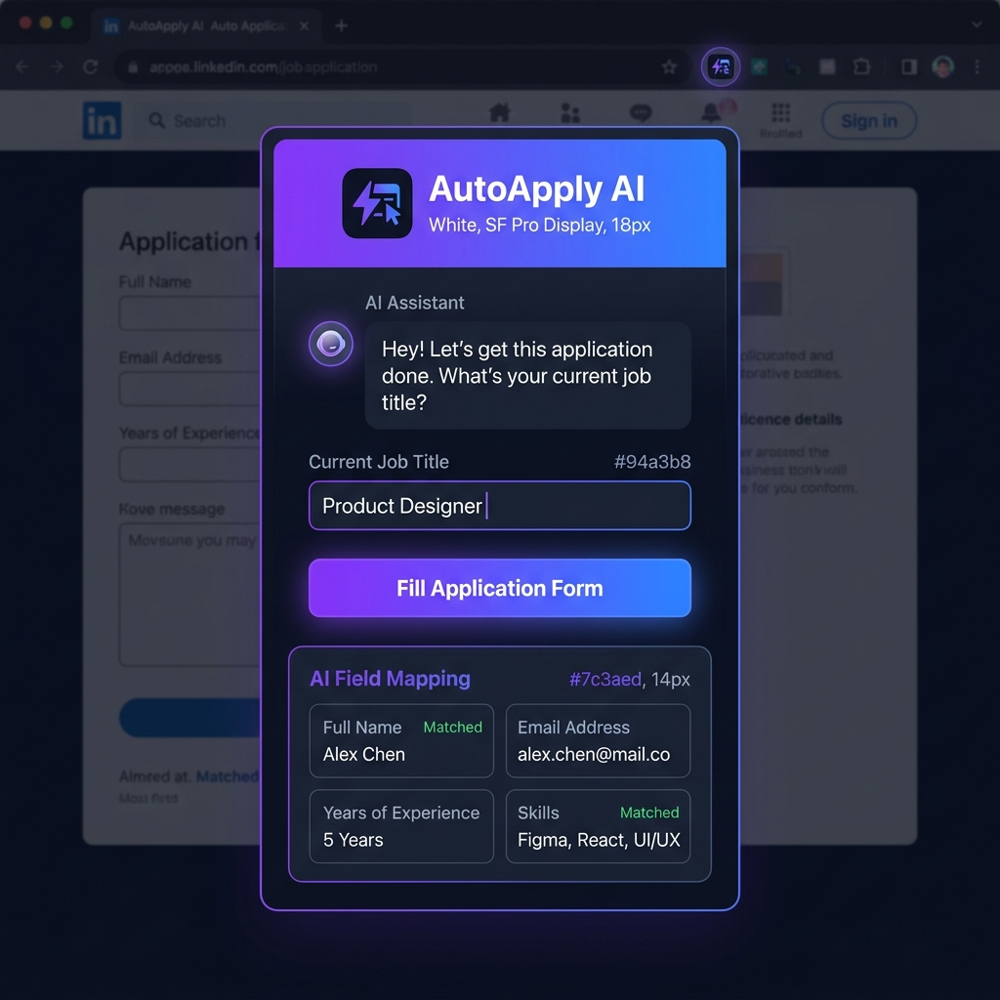
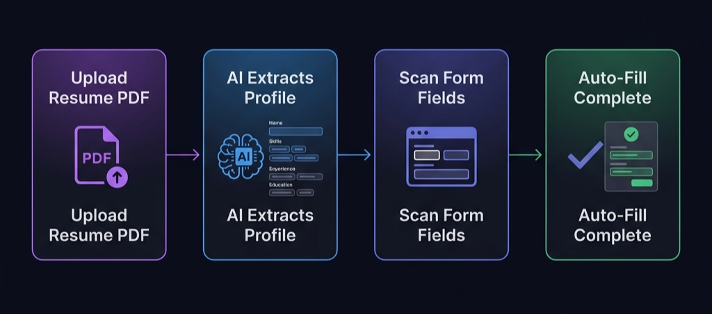
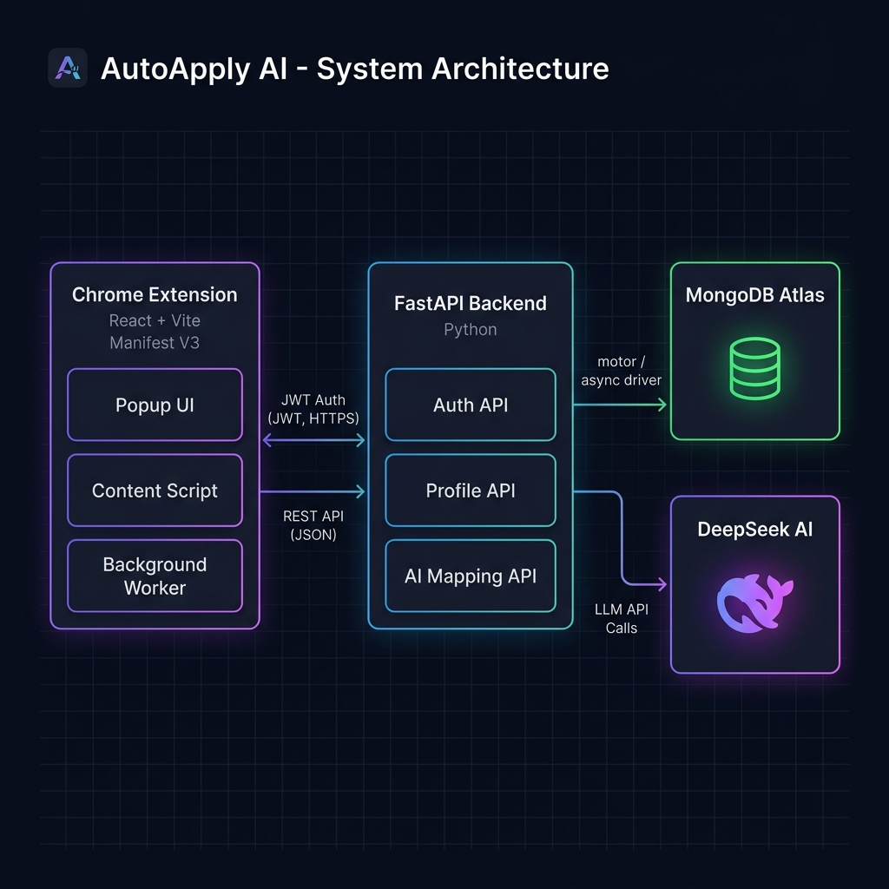

<div align="center">


# AutoApply AI

**Upload your resume once. Let AI fill every job application for you.**


<br/>



</div>

---

## What It Does

AutoApply AI is a Chrome extension that reads your PDF resume, builds a structured profile from it using AI, and then automatically fills job application forms on any job portal — LinkedIn, Greenhouse, Lever, Workday, and more.

You upload your resume **once**. After that, every application form is filled with a single click.

---

## How It Works



| Step | What Happens |
|---|---|
| **1. Upload Resume PDF** | You upload your PDF resume inside the extension popup |
| **2. AI Extracts Your Profile** | PyMuPDF extracts text from the PDF; DeepSeek AI parses it into structured fields — name, email, phone, skills, experience, education, LinkedIn, summary |
| **3. Navigate to a Job Application** | Open any job posting and click Apply. The content script automatically scans all form fields on the page |
| **4. AI Maps Fields to Your Profile** | DeepSeek AI reads the form's structure and maps each detected field to the correct value from your profile |
| **5. Review and Confirm** | A review screen shows every mapped value. Edit anything before submitting |
| **6. Form Auto-Filled** | One click fills every field with native event dispatching, compatible with React, Vue, and Angular forms |

---

## Architecture



| Layer | Technology | Role |
|---|---|---|
| **Chrome Extension** | React 18 + Vite + Tailwind CSS + Manifest V3 | Popup UI, form scanning, field injection |
| **Backend API** | Python + FastAPI + Uvicorn | Auth, profile storage, AI orchestration |
| **Resume Parser** | PyMuPDF (`fitz`) | Extracts raw text from uploaded PDF |
| **AI Engine** | DeepSeek API (`deepseek-chat`) | Profile extraction from resume + form field mapping |
| **Database** | MongoDB Atlas via Motor | Stores user accounts and parsed profiles |

---

## Features

- **Resume-to-Profile** — Upload a PDF; AI extracts all relevant fields automatically. No manual data entry
- **Intelligent Field Mapping** — DeepSeek AI reads the visible form structure and maps fields correctly, even for custom or unusual field names
- **Custom Memory** — Fields you fill manually on forms are remembered and used in future applications
- **Review Before Fill** — Every mapped value is shown on a review screen before anything is written
- **One-Click Fill** — Injects values into inputs, selects, and textareas with native event dispatch (works with React, Vue, Angular)
- **Portal Detection** — Automatically detects the ATS platform (Greenhouse, Lever, Workday, LinkedIn, etc.) and adjusts mapping logic
- **Profile Chat Editor** — After setup, refine your profile via a chat interface ("add Python to my skills", "update my job title")
- **Persistent Auth** — JWT-based login with 365-day sessions stored in `chrome.storage.local`
- **Dark Glass-Morphism UI** — Polished dark popup with smooth animations

---

## Supported Job Platforms

| Platform | Detection |
|---|---|
| LinkedIn Easy Apply | Automatic |
| Greenhouse | Automatic |
| Lever | Automatic |
| Workday | Automatic |
| Indeed | Automatic |
| iCIMS | Automatic |
| Taleo | Automatic |
| SmartRecruiters | Automatic |
| Ashby | Automatic |
| BambooHR | Automatic |
| Any HTML form | Generic fallback |

---

## Project Structure

```
AutoApply/
├── backend/
│   ├── main.py              # All API routes: auth, profile, resume parsing, AI mapping
│   ├── models.py            # Pydantic models for all request/response schemas
│   ├── auth.py              # JWT signing, bcrypt hashing, token verification middleware
│   ├── database.py          # Async MongoDB connection using Motor
│   ├── requirements.txt     # Python dependencies
│   └── .env                 # Environment variables (not committed)
│
└── extension/
    ├── public/
    │   ├── manifest.json    # Chrome Manifest V3 config
    │   ├── background.js    # Service worker — tab event listener
    │   ├── content.js       # Form scanner: detects portals, extracts fields, fills inputs
    │   └── icons/           # Extension icons (16, 48, 128px)
    └── src/
        ├── components/
        │   ├── Auth/        # Login and Register screens
        │   ├── Onboarding/  # ResumeUpload — the primary onboarding flow
        │   ├── Chat/        # ProfileChatEditor — post-setup profile editing via chat
        │   ├── Review/      # ReviewScreen and FieldCard — confirm before fill
        │   └── UI/          # Button, Spinner, Toast
        ├── hooks/
        │   ├── useFormFill  # Orchestrates scan → map → fill pipeline
        │   └── useAuth      # Auth state and logout
        ├── services/
        │   ├── api.js       # HTTP client for all backend calls
        │   └── storage.js   # chrome.storage helpers (token, user, resume)
        └── pages/
            ├── PopupApp.jsx # Root component — routes between views
            └── Dashboard.jsx # Main dashboard — fill button, profile view, resume re-upload
```

---

## Setup and Installation

### Prerequisites

- Python 3.10 or higher
- Node.js 18 or higher
- A [MongoDB Atlas](https://www.mongodb.com/atlas) cluster (free tier is sufficient)
- A [DeepSeek API](https://platform.deepseek.com/) key

---

### 1. Backend

```bash
cd backend

# Create and activate a virtual environment
python -m venv venv
venv\Scripts\activate          # Windows
# source venv/bin/activate     # macOS / Linux

# Install dependencies
pip install -r requirements.txt
```

Create `backend/.env`:

```env
MONGODB_URI=mongodb+srv://<username>:<password>@cluster.mongodb.net/autoapply
DEEPSEEK_API_KEY=your_deepseek_api_key_here
JWT_SECRET=a_long_random_secret_string
PORT=8000
```

Start the server:

```bash
uvicorn main:app --reload --host 0.0.0.0 --port 8000
```

API runs at `http://localhost:8000`. Interactive docs at `http://localhost:8000/docs`.

---

### 2. Extension Build

```bash
cd extension
npm install
npm run build
```

This outputs the packaged extension to `extension/dist/`.

---

### 3. Load in Chrome

1. Go to `chrome://extensions`
2. Enable **Developer Mode** (top-right toggle)
3. Click **Load unpacked**
4. Select the `extension/dist/` folder
5. Click the AutoApply icon in your toolbar

---

## API Reference

| Method | Endpoint | Auth | Description |
|---|---|---|---|
| `POST` | `/api/auth/register` | No | Create a new account |
| `POST` | `/api/auth/login` | No | Login and receive a JWT |
| `GET` | `/api/auth/me` | Yes | Get current user info |
| `GET` | `/api/profile` | Yes | Fetch saved profile |
| `PUT` | `/api/profile` | Yes | Overwrite profile fields |
| `POST` | `/api/profile/parse-resume` | Yes | **Upload PDF → AI extracts profile** |
| `POST` | `/api/profile/chat-update` | Yes | Update profile via natural language |
| `POST` | `/api/profile/memory` | Yes | Save custom field answers for future use |
| `POST` | `/api/ai/map-fields` | Yes | Map detected form fields to profile data |

Protected endpoints require `Authorization: Bearer <token>` header.

---

## Environment Variables

| Variable | Required | Description |
|---|---|---|
| `MONGODB_URI` | Yes | MongoDB Atlas connection string |
| `DEEPSEEK_API_KEY` | Yes | DeepSeek platform API key |
| `JWT_SECRET` | Yes | Secret used to sign and verify JWT tokens |
| `PORT` | No | Server port, defaults to `8000` |

---

## Tech Stack

| Component | Technology |
|---|---|
| Extension Frontend | React 18, Tailwind CSS v3, Vite 5 |
| Chrome Extension API | Manifest V3, Content Scripts, Service Worker |
| Backend | FastAPI, Uvicorn (ASGI) |
| Database | MongoDB Atlas, Motor (async driver) |
| Authentication | PyJWT, bcrypt (passlib) |
| Resume Parsing | PyMuPDF (`fitz`) — PDF text extraction |
| AI Integration | DeepSeek API via OpenAI-compatible client |
| Form Compatibility | Native `input`/`change` event dispatch — React, Vue, Angular |

---

## Development Notes

- The backend must be running locally for the extension to work
- For production, update `API_URL` in `extension/src/services/api.js` to your hosted server URL
- Resume upload supports PDF only (max 5MB). The first 15,000 characters of extracted text are sent to the AI
- The content script builds a "form outline" — visible page text with embedded field markers — which gives the AI full context about what each field is asking
- Custom memory: when a user manually edits a mapped field and confirms, that label-value pair is saved and used automatically in future applications

---

## Contributing

1. Fork this repository
2. Create a feature branch: `git checkout -b feature/your-feature-name`
3. Commit your changes with descriptive messages
4. Push to your fork and open a Pull Request

---

## License

This project is licensed under the **MIT License**.

---

<div align="center">

Built by [Pritam Mundhe](https://github.com/pritamundhe)

</div>
